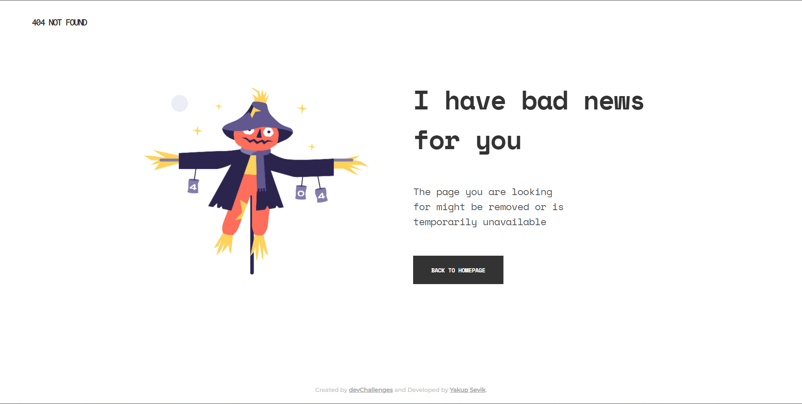
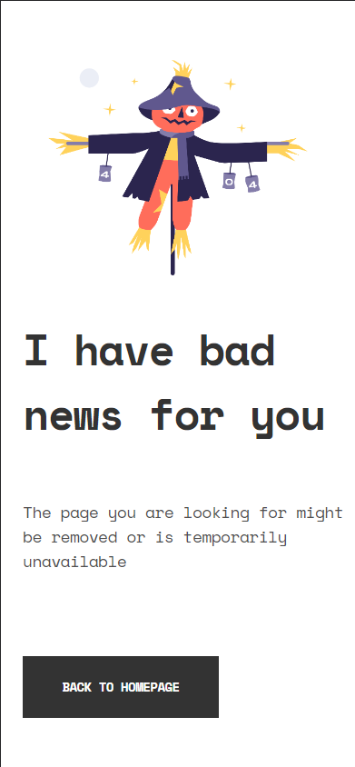

# Dev Challenges: 404 Not Found

_This is a challenge from Dev Challenges, specialized in frontend develop, is a 404 Not Found._

## [Try the live demo](#) ⚡

#

# Desktop



# Mobile



<br>

#

<br>

## Getting Started 🚀

_These instructions will get you a copy of the project up and running on your local machine for development and testing purposes. See deployment for notes on how to deploy the project on a live system._

See **Requirements** to know the minimum standards to use the project.

### Requirements 📋

_You need to have the following technologies installed to use this project._

Any browser to open the project.

* [Google Chrome](https://www.google.com/intl/es/chrome/)
* [Mozilla Firefox](https://www.mozilla.org/es-ES/firefox/new/)
* [Opera](https://www.opera.com/es)

<br>

#

<br>

## Installing 🔧

_To use this project you will need to clone this repository or download it to your computer. If you choose to download it directly in the upper right part of the repository you will have the option, if it is not your case you can clone it using the following command._

```ssh
  $ git clone #
```
<br>

#

<br>

## Use Project 👓

_To use this project after having it cloned or downloaded, we simply have to go to the project folder and open the file **index.html** with this we would have it working perfectly._

<br>

#

<br>

## Built With 🛠️

_Technologies used in the project:_

* [HTML 5](https://es.wikipedia.org/wiki/HTML) - Layout and web structure.
* [CSS 3](https://es.wikipedia.org/wiki/Hoja_de_estilos_en_cascada) - Style design.

<br>

#

<br>